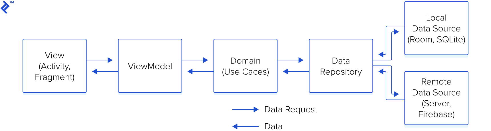

# BaseProject - Code base for Android Application
This is my base project for android coding. I have used the rich Jetpack libs and combine between MVVM and Clean Architecture for my base project.

## Table of contents
* [Architecture](#architecture)
* [Technical Stack](#technical_stack)

## Architecture
### Clean Architecture

### Architecture Component

## Project Structure

## Technical Stack
- [Jetpack](https://developer.android.com/jetpack):
    - [Android KTX](https://developer.android.com/kotlin/ktx.html) - provide concise, idiomatic Kotlin to Jetpack and Android platform APIs.
    - [AndroidX](https://developer.android.com/jetpack/androidx) - major improvement to the original Android [Support Library](https://developer.android.com/topic/libraries/support-library/index), which is no longer maintained.
    - [Data Binding](https://developer.android.com/topic/libraries/data-binding/) - allows you to bind UI components in your layouts to data sources in your app using a declarative format rather than programmatically.
    - [View Binding](https://developer.android.com/topic/libraries/view-binding/) - View binding is a feature that allows you to more easily write code that interacts with views. Once view binding is enabled in a module, it generates a binding class for each XML layout file present in that module. An instance of a binding class contains direct references to all views that have an ID in the corresponding layout.
    - [Lifecycle](https://developer.android.com/topic/libraries/architecture/lifecycle) - perform actions in response to a change in the lifecycle status of another component, such as activities and fragments.
    - [LiveData](https://developer.android.com/topic/libraries/architecture/livedata) - lifecycle-aware, meaning it respects the lifecycle of other app components, such as activities, fragments, or services.
    - [Navigation](https://developer.android.com/guide/navigation/) - helps you implement navigation, from simple button clicks to more complex patterns, such as app bars and the navigation drawer.
    - [Paging](https://developer.android.com/topic/libraries/architecture/paging/) - helps you load and display small chunks of data at a time. Loading partial data on demand reduces usage of network bandwidth and system resources.
    - [ViewModel](https://developer.android.com/topic/libraries/architecture/viewmodel) - designed to store and manage UI-related data in a lifecycle conscious way. The ViewModel class allows data to survive configuration changes such as screen rotations.
    - [Worker](https://developer.android.com/reference/androidx/work/Worker) - A class that performs work synchronously on a background thread provided by WorkManager.
- [Dagger2](https://dagger.dev/) - dependency injector for replacement all FactoryFactory classes.
- [Retrofit](https://square.github.io/retrofit/) - type-safe HTTP client.
- [Glide](https://github.com/bumptech/glide) - Glide is a fast and efficient open source media management and image loading framework for Android that wraps media decoding, memory and disk caching, and resource pooling into a simple and easy to use interface.

